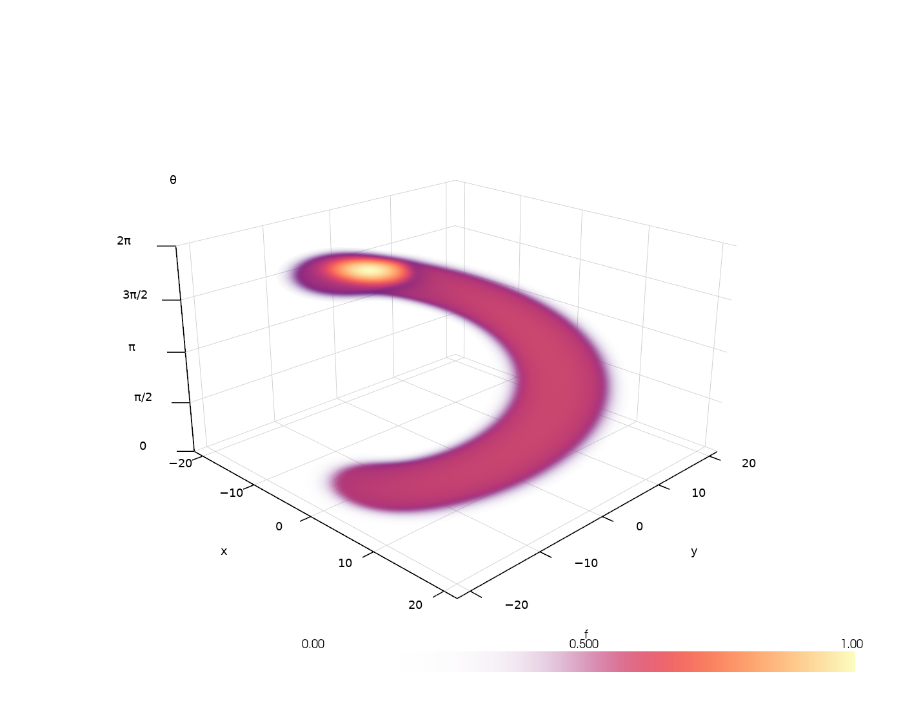
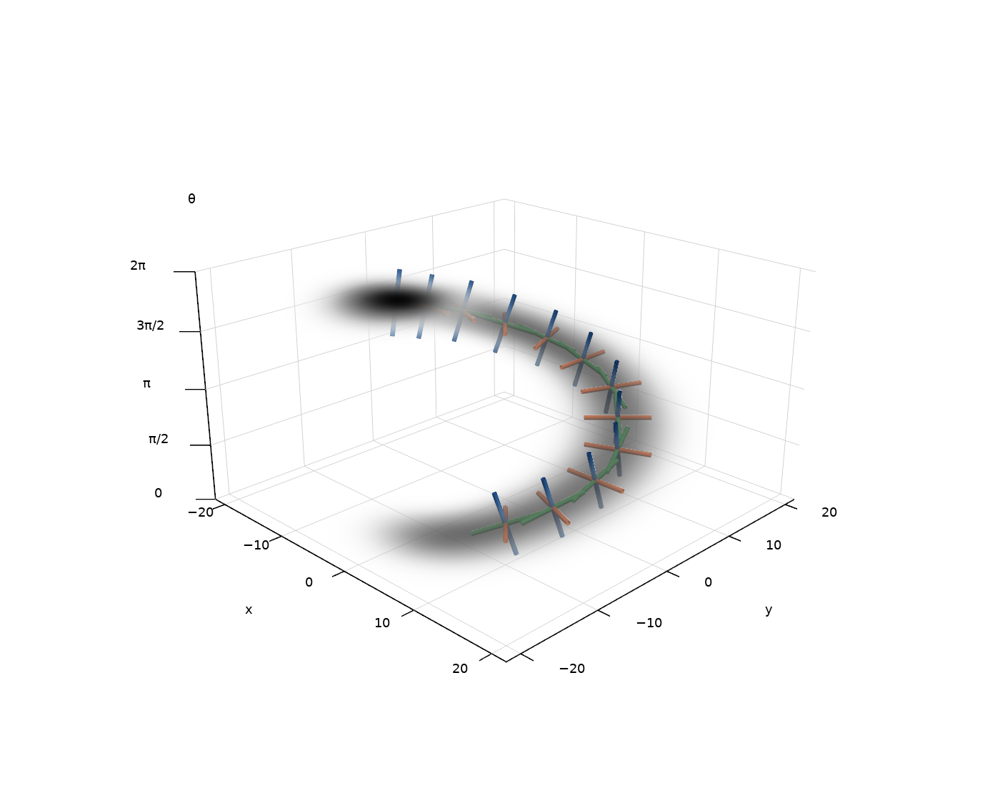
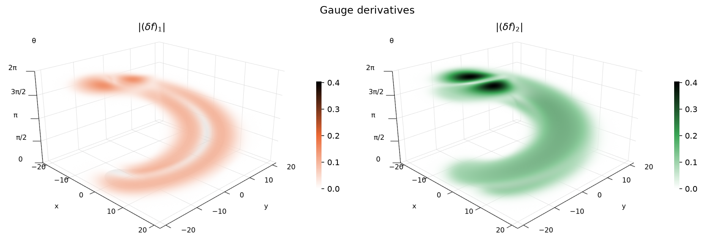
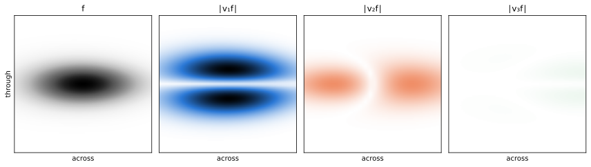

# Gauge Derivatives

With this library you can calculate gauge derivatives of tensor fields on a manifold endowed with a metric tensor field and a connection.

A _field_ is a tensor-valued signal on a manifold.
A _gauge frame_ is a basis of vector fields derived from a scalar field, e.g. from its structure tensor or Hessian.
A _gauge derivative_ of a field is a derivative in a gauge frame direction.

More formally, let $M$ be an $n$-dimensional manifold, $\nabla : \Gamma(T^{(p,q)}M) \to \Gamma(T^{(p,q+1)} M)$ the total covariant derivative on tensor fields (induced by some connection), and $v_1, \dots, v_n \in \Gamma(T M)$ a gauge frame obtained from a scalar field $f : M \to \mathbb{R}$.
The gauge derivative of signature $(i_1, \dots i_m)$ is defined as
$$
    (\delta f)_{(i_1, \dots i_m)} := (\nabla^m f)(v_{i_1}, \dots, v_{i_m})
$$

## Gauge frame


Structure tensor and Hessian frames on a crop of a photograph.
Blue is the first frame vector, orange the second.
For the structure tensor, blue runs along edges and orange across them.



A ribbon on `M2 = R² × S¹` around the circle lifted to its tangent angle, drawn in
`(x, y, ξθ)`, where the metric `diag(1, 1, ξ²)` in the frame `A` looks Euclidean.



Structure tensor frame of the ribbon, blurred over the size of the ribbon. Blue is through
the ribbon, orange across it and green along it.

## Gauge derivatives






First gauge derivatives `|v_i f|` of the ribbon in its structure tensor frame, blurred over
the size of the ribbon, as densities and on a cross-section. The sign of each frame vector is
arbitrary, hence the absolute value. `v_1 f` picks up the faces of the ribbon, `v_2 f` its
edges, and `v_3 f` is zero, as nothing changes along the ribbon.

## Tensor fields

A `Field` is a `torch.Tensor`, that being an array with a _shape_, with an additional _type string_ with `len(shape)=len(type)`.

| character | meaning |
|-----------|---------|
| `b` | batch |
| `s` | spatial |
| `u` | upper index |
| `l` | lower index |

Batch dimensions come first, then spatial, then indices, with upper and lower in any
order.
The number of `s`'s in the type is called `n` and is the number of spatial dimensions.
Every index has size `n`.
A spatial dimension of size 1 broadcasts: the field is constant along it.

Indices are components in the grid basis unless converted with `change_basis`, and the
type string does not record which. `partial_derivative`, `covariant_derivative`,
`gradient`, the difference tensors and `gaussian_blur` need every index in the grid basis.
`contract` and `trace` need the two summed indices in the same basis, and `inner_product`
and `norm2` need all their arguments in the same basis.

### Common fields

On a 2D grid of `H×W` points, with a batch of `B`:

| shape | type | object | examples |
|-------|------|--------|----------|
| `[H,W]` | `ss` | scalar field | image `f` |
| `[B,H,W]` | `bss` | batch of scalar fields | several images |
| `[H,W,2]` | `ssu` | vector field | gradient `g^ij e_j(f)` |
| `[H,W,2]` | `ssl` | covector field | differential `e_i(f)` |
| `[H,W,2,2]` | `ssll` | (0,2)-tensor field | metric `g_ij` (`[1,1,2,2]` if constant), Hessian `(∇ ∇ f)_ij`, structure tensor `(S f)_ij` |
| `[H,W,2,2]` | `ssuu` | (2,0)-tensor field | inverse metric `g^ij` |
| `[H,W,2,2]` | `ssul` | (1,1)-tensor field | frame `F^i_j`, linear mappings `A^i_j` |
| `[H,W,2,…,2]` | `ssl…l` | k lower indices | k-th covariant derivative of `f` |
| `[H,W,2,2,2]` | `ssull` | (1,2)-tensor field  | difference tensor `D = ∇ − ∇^flat` from the grid's flat connection `∇^flat` |

## Example

```python
import torch
from field import Field
from frames import gauge_jet, structure_tensor_frame
from gaussian_blur import gaussian_blur
from geometry import levi_civita_difference_tensor

H, W = 64, 64
signal = Field(torch.randn(H, W), "ss")
signal = gaussian_blur(signal, sigma=2.0)
metric = Field(torch.eye(2).reshape(1, 1, 2, 2), "ssll")
difference_tensor = levi_civita_difference_tensor(metric)
eigenvalues, gauge_frame = structure_tensor_frame(signal, 1.0, metric)
gauge_derivatives = gauge_jet(signal, gauge_frame, difference_tensor, 2)
```

## Example on M2

Second-order gauge derivatives of a blurred random signal on position orientation space
`M2 = R² × S¹`, in the gauge frame of the Hessian. The connection is the one for which the
left-invariant frame `A_1 = cos θ ∂_x + sin θ ∂_y`, `A_2 = −sin θ ∂_x + cos θ ∂_y`,
`A_3 = ∂_θ` is parallel, and the metric is constant in that frame.

```python
import torch
from field import Field
from frames import constant_metric_in_frame, gauge_jet, hessian_frame
from gaussian_blur import gaussian_blur
from geometry import weitzenbock_difference_tensor
from m2 import left_invariant_frame

O, H, W = 64, 64, 64
signal = Field(torch.randn(O, H, W), "sss")
signal = gaussian_blur(signal, sigma=2.0)
li_frame = left_invariant_frame(O)
difference_tensor = weitzenbock_difference_tensor(li_frame)
G = torch.diag(torch.tensor([1.0, 4.0, 0.5]))
metric = constant_metric_in_frame(G, li_frame)
values, gauge_frame = hessian_frame(signal, difference_tensor, metric)
gauge_derivatives = gauge_jet(signal, gauge_frame, difference_tensor, 2)
```

## Functions

`B` is any number of batch dimensions, `S` the spatial dimensions, and
`I`, `J` any string of `u` and `l`.

### `field.py`

`Field(data, type)`, and:

| function | takes | returns | computes |
|----------|-------|---------|----------|
| `tensor_product(a, b)` | `a: BSI`, `b: BSJ` | `BSIJ` | `a ⊗ b` |
| `contract(a, i, b, j)` | `a: BSI`, `b: BSJ` | `BSIJ` without the pair | sum of index `i` of `a` with index `j` of `b` |
| `trace(field, i, j)` | `field: BSI` | `BSI` without the pair | sum of indices `i` and `j` of `field` |
| `change_basis(field, frame, index)` | `field: BSI`, `frame: BSul` | `BSI` | index `index` from the grid basis to the frame |

### `geometry.py`

| function | takes | returns | computes |
|----------|-------|---------|----------|
| `partial_derivative(field)` | `field: BSI` | `BSIl` | `∇^flat T` |
| `differential(field)` | `field: BS` | `BSl` | `df` |
| `gradient(field, metric)` | `field: BS`, `metric: Sll` | `BSu` | `grad f = g^ij e_j(f) e_i` |
| `inner_product(a, b, metric)` | `a, b: BSu` or `BSl`, `metric: Sll` | `BS` | `g_ij a^i b^j` or `g^ij a_i b_j` |
| `norm2(field, metric)` | `field: BSu` or `BSl`, `metric: Sll` | `BS` | `inner_product(field, field, metric)` |
| `levi_civita_difference_tensor(metric)` | `metric: Sll` | `Sull` | `D` of the Levi-Civita connection |
| `weitzenbock_difference_tensor(frame)` | `frame: Sul` | `Sull` | `D` of the connection for which the frame is parallel |
| `covariant_derivative(field, difference_tensor)` | `field: BSI`, `difference_tensor: Sull` | `BSIl` | `∇ T` with `∇ = ∇^flat + D` |

### `frames.py`

| function | takes | returns | computes |
|----------|-------|---------|----------|
| `eigenframe(form, metric)` | `form: BSll`, `metric: Sll` | `BSl`, `BSul` | stationary points of `F(v,v)` with `g(v,v) = 1` |
| `singular_frames(form, metric)` | `form: BSll`, `metric: Sll` | `BSl`, `BSul`, `BSul` | `σ` and the left and right singular frames of `F` in `g` |
| `structure_tensor_frame(field, sigma, metric)` | `field: BS`, `metric: Sll` | `BSl`, `BSul` | eigenframe of `df ⊗ df` blurred with `sigma` |
| `hessian_frame(field, difference_tensor, metric)` | `field: BS`, `difference_tensor: Sull`, `metric: Sll` | `BSl`, `BSul` | eigenframe of `∇∇f` |
| `constant_metric_in_frame(metric, frame)` | `metric: [n, n]`, `frame: Sul` | `Sll` | metric with components `G` in the frame |
| `gauge_jet(field, frame, difference_tensor, order)` | `field: BSI`, `frame: BSul`, `difference_tensor: Sull` | `BSI` + `order` × `l` | `order`-th covariant derivative, every index in the frame |

### `m2.py`

| function | takes | returns | computes |
|----------|-------|---------|----------|
| `left_invariant_frame(orientations, dx)` | number of orientations, grid step `dx` in y and x | `sssul` | forward, sideways and turn frame `A_1, A_2, A_3` of `M2 = R² × S¹` |

### `gaussian_blur.py`

| function | takes | returns | computes |
|----------|-------|---------|----------|
| `gaussian_blur(field, sigma)` | `field: BSI` | `BSI` | Gaussian blur along `S`, periodic boundaries |

`make_figures.py` regenerates the figures.