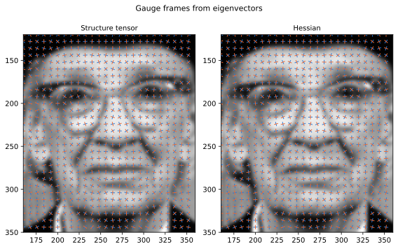
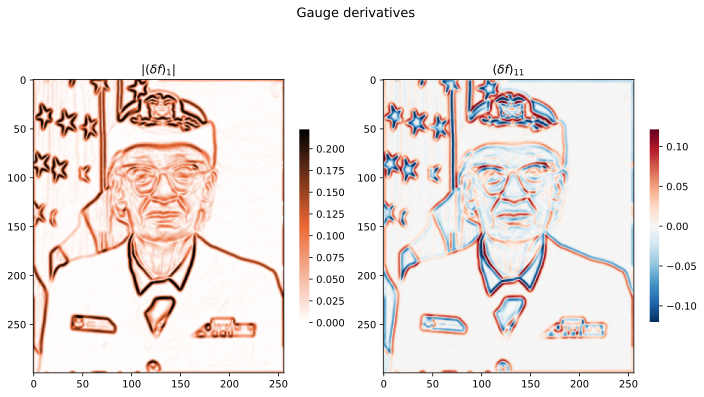

# Gauge Derivatives

## Example

```python
import torch
from gaussian_blur import gaussian_blur
from derivative import derivative_tensor, gauge_derivative
from frames import gauge_frame_structure_tensor

field = torch.randn(64, 64)
blurred = gaussian_blur(field, sigma=2.0)               # (64, 64)

derivative_tensor(blurred, k=1)                         # (64, 64, 2)
derivative_tensor(blurred, k=3)                         # (64, 64, 2, 2, 2)

frame = gauge_frame_structure_tensor(blurred, sigma=1.0)  # (64, 64, 2, 2)
gauge_derivative(blurred, frame, [0, 1, 1])               # (64, 64)
```

## Gauge frame



Both frames on a crop of a photograph. 
Blue is the first frame vector, orange the second.
For the structure tensor they run along and across the local edge. 

## Gauge derivatives

 

## Modules

| file | contents |
|------|----------|
| `derivative.py` | `derivative_tensor` (the k-jet), `grad`, `hessian`, `gauge_derivative` |
| `frames.py` | `gauge_frame_hessian`, `gauge_frame_structure_tensor` |
| `gaussian_blur.py` | `gaussian_blur` |
| `utils.py` | `normalize_dims` |
| `main.ipynb` | worked example and the figures above |