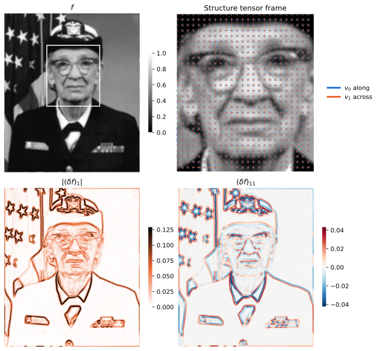
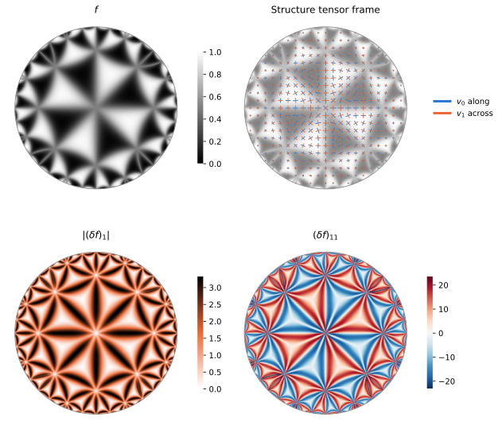
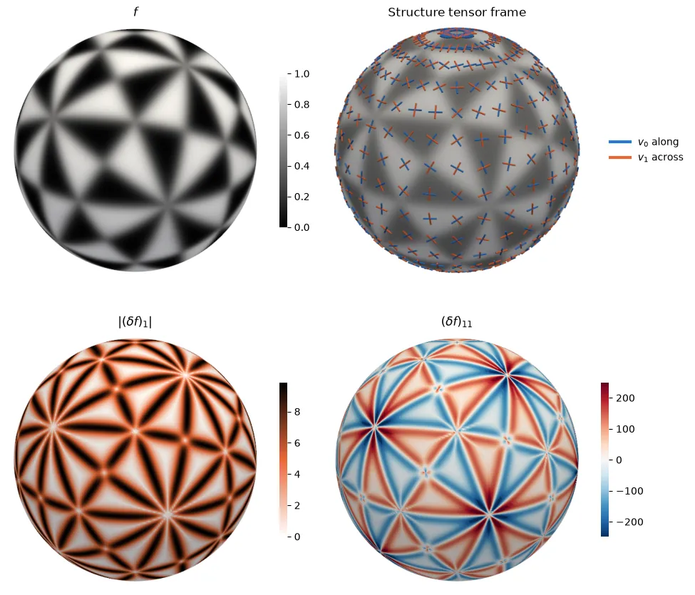
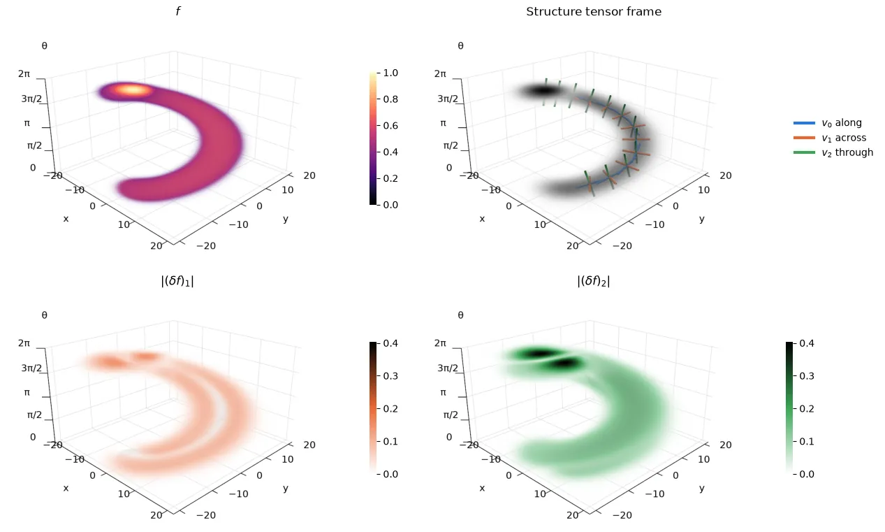

# Gauge Derivatives

With this library you can calculate gauge derivatives of tensor fields on a manifold endowed with a metric tensor field and a connection.

A _field_ is a tensor-valued signal on a manifold.
A _gauge frame_ is a basis of vector fields derived from a scalar field, e.g. from its structure tensor or Hessian.
A _gauge derivative_ of a field is a derivative in a gauge frame direction.

More formally, let $`M`$ be an $`n`$-dimensional manifold, $`\nabla : \Gamma(T^{(p,q)}M) \to \Gamma(T^{(p,q+1)} M)`$ the total covariant derivative on tensor fields (induced by some connection), and $`v_0, \dots, v_{n-1} \in \Gamma(T M)`$ a gauge frame obtained from a scalar field $`f : M \to \mathbb{R}`$.
The gauge derivative of signature $`(i_1, \dots i_m)`$ is defined as
$$
    (\delta f)_{(i_1, \dots i_m)} := (\nabla^m f)(v_{i_1}, \dots, v_{i_m})
$$

## Gauge Derivatives on R2



```python
import torch
from frames import structure_tensor_frame
from geometry import covariant_derivative_in_frame, levi_civita_connection
from grid import gaussian_blur

B, H, W = 4, 64, 64
signal = torch.randn(B, H, W)                 # [4, 64, 64]
signal = gaussian_blur(signal, 2.0, [1, 2])   # [4, 64, 64]
metric = torch.eye(2).reshape(1, 1, 1, 2, 2)  # [1, 1, 1, 2, 2]
connection = levi_civita_connection(metric)   # [1, 1, 1, 2, 2, 2]
eigenvalues, gauge_frame = structure_tensor_frame(signal, 1.0, metric)  # [4, 64, 64, 2], [4, 64, 64, 2, 2]
gauge_derivatives = covariant_derivative_in_frame(signal, gauge_frame, connection, 2)  # [4, 64, 64, 2, 2]
```

## Gauge Derivatives on the Poincaré disk



```python
import torch
from frames import structure_tensor_frame
from geometry import covariant_derivative_in_frame, levi_civita_connection
from grid import gaussian_blur
from manifolds import poincare_metric

B, N = 4, 256
signal = torch.randn(B, N, N)                # [4, 256, 256]
signal = gaussian_blur(signal, 2.0, [1, 2])  # [4, 256, 256]
metric = poincare_metric(N)                  # [1, 256, 256, 2, 2]
connection = levi_civita_connection(metric)  # [1, 256, 256, 2, 2, 2]
eigenvalues, gauge_frame = structure_tensor_frame(signal, 1.0, metric)  # [4, 256, 256, 2], [4, 256, 256, 2, 2]
gauge_derivatives = covariant_derivative_in_frame(signal, gauge_frame, connection, 2)  # [4, 256, 256, 2, 2]
```

## Gauge Derivatives on S2



```python
import torch
from frames import structure_tensor_frame
from geometry import covariant_derivative_in_frame, levi_civita_connection
from grid import gaussian_blur
from manifolds import sphere_metric

B, T, P = 4, 128, 256
signal = torch.randn(B, T, P)                # [4, 128, 256]
signal = gaussian_blur(signal, 2.0, [1, 2])  # [4, 128, 256]
metric = sphere_metric(T, P)                 # [1, 128, 256, 2, 2]
connection = levi_civita_connection(metric)  # [1, 128, 256, 2, 2, 2]
eigenvalues, gauge_frame = structure_tensor_frame(signal, 1.0, metric)  # [4, 128, 256, 2], [4, 128, 256, 2, 2]
gauge_derivatives = covariant_derivative_in_frame(signal, gauge_frame, connection, 2)  # [4, 128, 256, 2, 2]
```

## Gauge Derivatives on M2



```python
import torch
from frames import hessian_frame
from geometry import constant_metric_in_frame, covariant_derivative_in_frame, weitzenbock_connection
from grid import gaussian_blur
from manifolds import m2_natural_frame

B, O, H, W = 4, 64, 64, 64
signal = torch.randn(B, O, H, W)                     # [4, 64, 64, 64]
signal = gaussian_blur(signal, 2.0, [1, 2, 3])       # [4, 64, 64, 64]
natural_frame = m2_natural_frame(O)                  # [1, 64, 1, 1, 3, 3]
connection = weitzenbock_connection(natural_frame)   # [1, 64, 1, 1, 3, 3, 3]
G = torch.diag(torch.tensor([1.0, 4.0, 0.5]))
metric = constant_metric_in_frame(G, natural_frame)  # [1, 64, 1, 1, 3, 3]
values, gauge_frame = hessian_frame(signal, connection, metric)  # [4, 64, 64, 64, 3], [4, 64, 64, 64, 3, 3]
gauge_derivatives = covariant_derivative_in_frame(signal, gauge_frame, connection, 2)  # [4, 64, 64, 64, 3, 3]
```