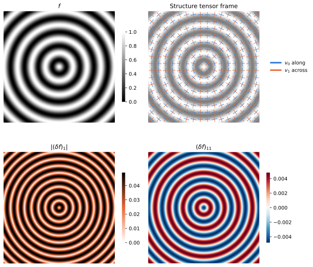
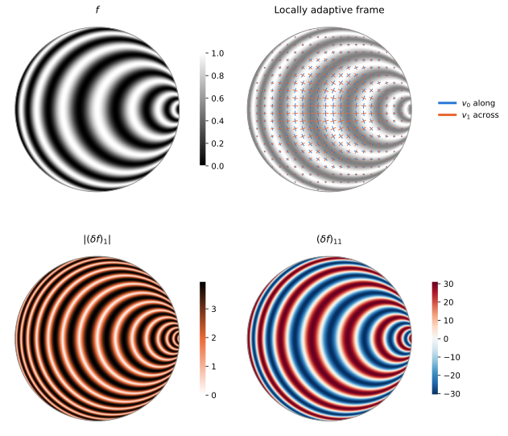
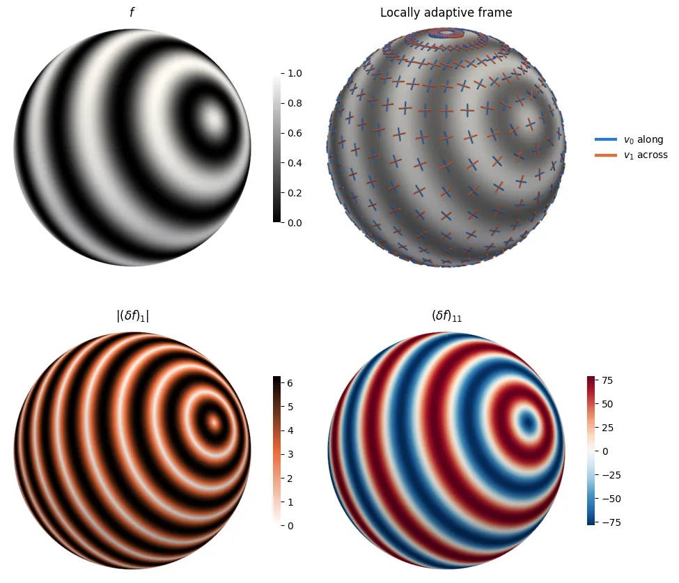
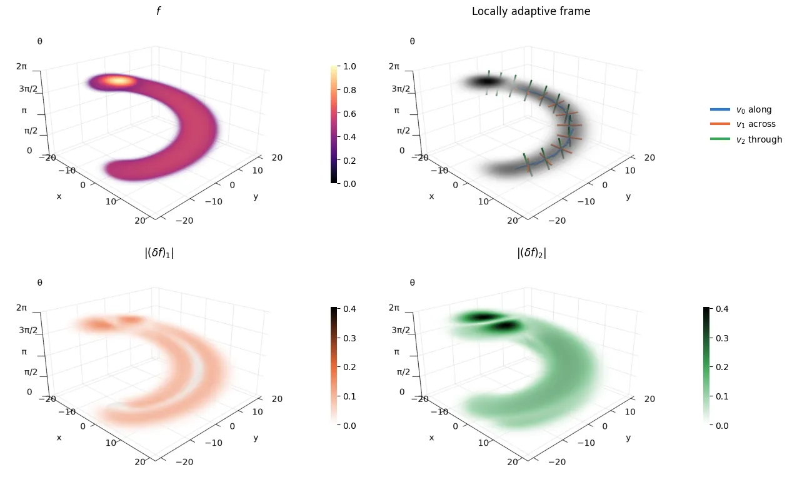
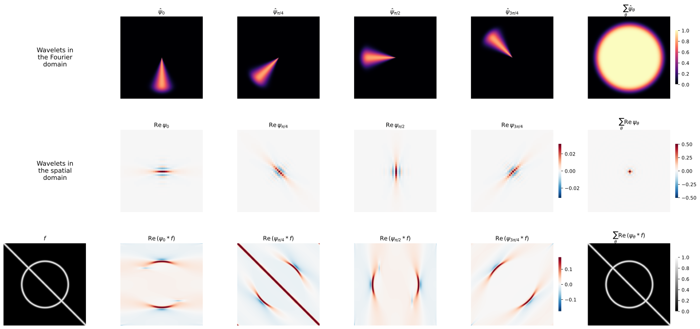

# Gauge Derivatives

With this library you can calculate gauge derivatives of tensor fields on a manifold endowed with a metric tensor field and a connection.

A _field_ is a tensor-valued signal on a manifold.
A _gauge frame_ is a basis of vector fields derived from a scalar field, e.g. from its structure tensor or Hessian.
A _gauge derivative_ of a field is a derivative in a gauge frame direction.

More formally, let $M$ be an $n$-dimensional manifold, $\nabla : \Gamma(T^{(p,q)}M) \to \Gamma(T^{(p,q+1)} M)$ the total covariant derivative on tensor fields (induced by some connection), and $v_0, \dots, v_{n-1} \in \Gamma(T M)$ a gauge frame obtained from a scalar field $f : M \to \mathbb{R}$.
The gauge derivative of signature $(i_1, \dots, i_m)$ is defined as

$$
(\delta f)_{(i_1, \dots, i_m)} := (\nabla^m f)(v_{i_1}, \dots, v_{i_m})
$$

## Gauge Derivatives on R2



```python
import torch
from frames import eigenframe, structure_field
from geometry import covariant_derivative_in_frame, levi_civita_connection
from grid import gaussian_blur

B, H, W = 4, 64, 64
signal = torch.randn(B, H, W)                 # [B, H, W]
signal = gaussian_blur(signal, 2.0, [1, 2])   # [B, H, W]
metric = torch.eye(2).reshape(1, 1, 1, 2, 2)  # [1, 1, 1, 2, 2]
connection = levi_civita_connection(metric)   # [1, 1, 1, 2, 2, 2]
structure = structure_field(signal, metric, sigma=1.0)  # [B, H, W, 2, 2]
# structure = hessian_field(signal, connection, metric, sigma=1.0)
values, gauge_frame = eigenframe(structure, metric)  # [B, H, W, 2], [B, H, W, 2, 2]
first_order_gauge_derivatives = covariant_derivative_in_frame(signal, gauge_frame, connection, order=1)  # [B, H, W, 2]
second_order_gauge_derivatives = covariant_derivative_in_frame(signal, gauge_frame, connection, order=2)  # [B, H, W, 2, 2]
```

## Gauge Derivatives on the Poincaré disk



```python
import torch
from frames import eigenframe, structure_field
from geometry import covariant_derivative_in_frame, levi_civita_connection
from grid import gaussian_blur
from manifolds import poincare_metric

B, N = 4, 256
signal = torch.randn(B, N, N)                # [B, N, N]
signal = gaussian_blur(signal, 2.0, [1, 2])  # [B, N, N]
metric = poincare_metric(N)                  # [1, N, N, 2, 2]
connection = levi_civita_connection(metric)  # [1, N, N, 2, 2, 2]
structure = structure_field(signal, metric, sigma=1.0)  # [B, N, N, 2, 2]
# structure = hessian_field(signal, connection, metric, sigma=1.0)
values, gauge_frame = eigenframe(structure, metric)  # [B, N, N, 2], [B, N, N, 2, 2]
first_order_gauge_derivatives = covariant_derivative_in_frame(signal, gauge_frame, connection, order=1)  # [B, N, N, 2]
second_order_gauge_derivatives = covariant_derivative_in_frame(signal, gauge_frame, connection, order=2)  # [B, N, N, 2, 2]
```

## Gauge Derivatives on S2



```python
import torch
from frames import eigenframe, structure_field
from geometry import covariant_derivative_in_frame, levi_civita_connection
from grid import gaussian_blur
from manifolds import sphere_metric

B, T, P = 4, 128, 256
signal = torch.randn(B, T, P)                # [B, T, P]
signal = gaussian_blur(signal, 2.0, [1, 2])  # [B, T, P]
metric = sphere_metric(T, P)                 # [1, T, P, 2, 2]
connection = levi_civita_connection(metric)  # [1, T, P, 2, 2, 2]
structure = structure_field(signal, metric, sigma=1.0)  # [B, T, P, 2, 2]
# structure = hessian_field(signal, connection, metric, sigma=1.0)
values, gauge_frame = eigenframe(structure, metric)  # [B, T, P, 2], [B, T, P, 2, 2]
first_order_gauge_derivatives = covariant_derivative_in_frame(signal, gauge_frame, connection, order=1)  # [B, T, P, 2]
second_order_gauge_derivatives = covariant_derivative_in_frame(signal, gauge_frame, connection, order=2)  # [B, T, P, 2, 2]
```

## Gauge Derivatives on M2



```python
import torch
from frames import eigenframe, structure_field
from geometry import constant_metric_in_frame, covariant_derivative_in_frame, weitzenbock_connection
from grid import gaussian_blur
from manifolds import m2_natural_frame

B, O, H, W = 4, 64, 64, 64
signal = torch.randn(B, O, H, W)                     # [B, O, H, W]
signal = gaussian_blur(signal, 2.0, [1, 2, 3])       # [B, O, H, W]
natural_frame = m2_natural_frame(O)                  # [1, O, 1, 1, 3, 3]
connection = weitzenbock_connection(natural_frame)   # [1, O, 1, 1, 3, 3, 3]
G = torch.diag(torch.tensor([1.0, 4.0, 0.5]))
metric = constant_metric_in_frame(G, natural_frame)  # [1, O, 1, 1, 3, 3]
structure = structure_field(signal, metric, sigma=1.0)  # [B, O, H, W, 3, 3]
# structure = hessian_field(signal, connection, metric, sigma=1.0)
values, gauge_frame = eigenframe(structure, metric)  # [B, O, H, W, 3], [B, O, H, W, 3, 3]
first_order_gauge_derivatives = covariant_derivative_in_frame(signal, gauge_frame, connection, order=1)  # [B, O, H, W, 3]
second_order_gauge_derivatives = covariant_derivative_in_frame(signal, gauge_frame, connection, order=2)  # [B, O, H, W, 3, 3]
```
## Lifting to M2 with Cake Wavelets



```python
import torch
from grid import gaussian_blur
from lifting import cake_wavelets, lift

B, O, N = 4, 64, 64
image = torch.randn(B, N, N)                                             # [B, N, N]
image = gaussian_blur(image, 2.0, [1, 2])                                # [B, N, N]
wavelets = cake_wavelets(N, O, angular_sigma=0.15, radial_sigma=0.03)    # [O, N, N]
orientation_score = lift(image, wavelets)                                # [B, O, N, N]
signal = orientation_score.real                                          # [B, O, N, N]
```
